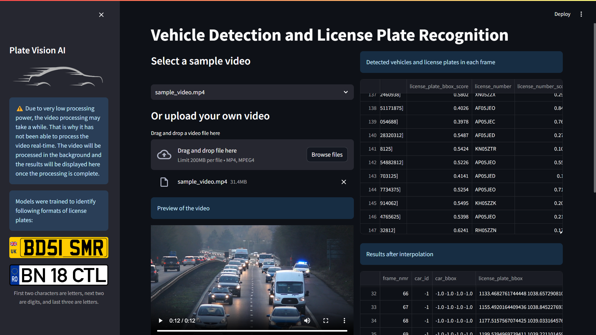
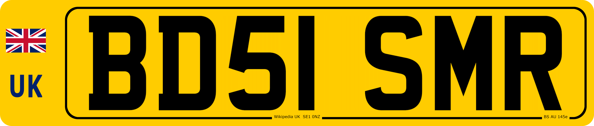

# Plate Vision AI
## Automated License Plate Recognition and Vehicle Detection




### Introduction
Plate Vision AI is a project that aims to automate the process of license plate recognition and vehicle detection. The project is built using the YOLOv8 object detection model and a custom model, pre-trained to recognize license plates. The project is built using Python, openCV, Streamlit.

### Getting Started

#### 1. Clone the repository
Clone the repository to your local machine using the following command:
```
git clone https://github.com/Irash-Perera/PlateVisionAI.git
```
#### 2. Clone the forked `Sort` repository
Clone the forked `Sort` repository to your local machine using the following command:
```
git clone https://github.com/Irash-Perera/Sort.git
```
#### 3. Install the required libraries
Install the required libraries using the following command:
```
pip install -r packages.txt
```
#### 4. Run the Streamlit app

Navigate to the `app` directory and run the Streamlit app using the following command:
```
streamlit run app.py
```

https://github.com/Irash-Perera/PlateVisionAI/assets/42272743/9b2ba2d1-4ad1-4a2f-8256-5dc81770439f

Note: To detect license plates and keep records, you need to upload a video file or select a video file from the given options. The reason for not being able to do this process in real-time is due to the limitations of processing power and the time it takes to process each frame.

After the video is processed, a new button will appear to interpolate the processed data. Click on the button to interpolate the data and display the results.

Finally, a new button will appear to view the final output. Click on the button to view the final output.

Instead of sending the input through a pipeline without any user interaction, I have designed the app allowing the user to interact with the app and view the results at each stage. This will help the user to understand the process and the results better.

After detecting the license plates and extracting the text from it, it will be sent through a format checking pipeline. Current checking format is only suppported for UK license plates.
<table>
  <tr>
    <td></td>
    <td></td>
  </tr>
</table>

